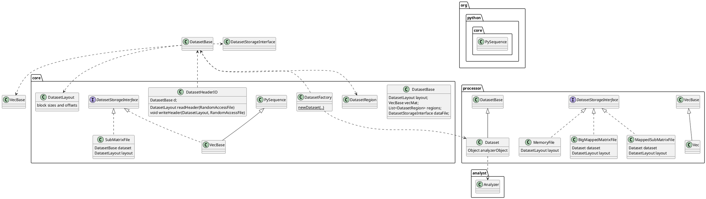

# Dataset related classes

## NV file format

The NV file format is described in [nv-file-format](nv-file-format.md).

This documentation is slightly outdated, a few fields have been added to the header.
It remains a good introduction to understand the file layout.

## Class diagram

## Notes

### Subclassing could be simplified

* Dataset is the only subclass of DatasetBase. There is no clear reason to keep them separated if we have them in the
  same maven module.
  * DatasetBase instances are created by:
    * NMRStarReader. However, the instance is discarded directly after creation! Unless there is a hidden side-effect,
      this has no use and could be removed.
    * DatasetFactory only if Dataset is not found (should never happen when running processor or analyst)
* Vec is the only subclass of VecBase. Same issue as between Dataset and DatasetBase
  * VecBase constructors are only called from Vec. There is no direct usage.

### Other issues due to maven modules separations

* Dataset contains an indirect/untyped reference to Analyzer
* DatasetFactory isn't always used, there are several direct usages of Dataset's constructor
  * It looks like DatasetFactory is only useful to create Dataset instances with reflection.

### Selecting a DatasetStorageInterface implementation

The main selection is done in the static method `Dataset.createDataFile()`.

Here's the selection criteria:

* if using cache file (true only when processing a data on windows), use SubMatrixFile
* otherwise, if the total number of points (converted to bytes) is more than `Integer.MAX_VALUE / 2`, use
  BigMappedMatrixFile.
  * this ignores the file header and block padding, this isn't the full file size.
* otherwise, if the layout correspond to a sub-matrix (true every time more than one block is defined), use
  MappedSubMatrixFile.
* finally, fallback to MappedMatrixFile.

I am not sure if MappedMatrixFile is really necessary. Is there's really a performance gain compared to
using MappedSubMatrix file even where there is a single block?

I am also not sure why using SubMatrixFile when processing on windows instead of MappedSubMatrixFile?

### Other notes

* DatasetBase indirectly depends on Jython.
* Cross-dependency between several DatasetStorageInterface implementations and Dataset(Base).

