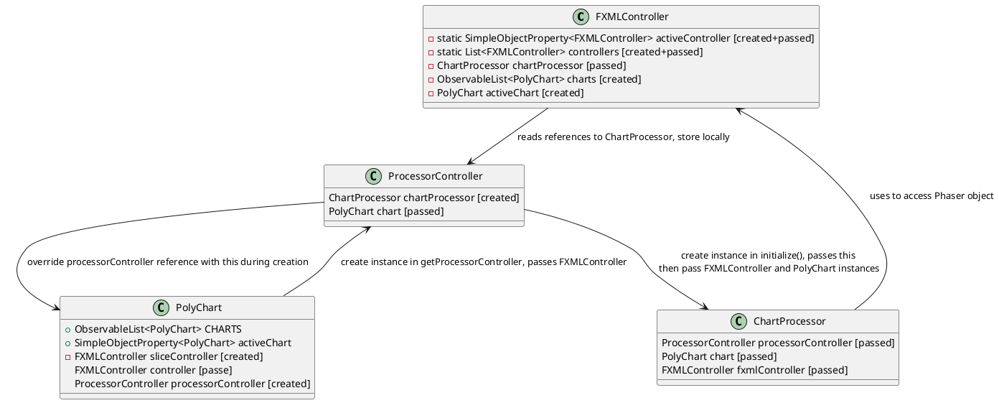

# Main UI classes

Some UI classes are a bit complex to comprehend. They either have too many responsabilties, an unclear role, or to many dependents.
Here are what I understood for some of them.

## FXMLController

The main NMRFx window. Can be opened multiple time.
It contains the menu, the toolbar, bottom tools, and references to the ProcessorController.

### Cross-dependencies
* PolyChart: 
  * FXMLController manages a list of PolyChart instance, with a single active one.
  * not 100% sure, but it looks like there are multiple PolyCharts in a single FXMLController only when displaying them on a grid? 
* ChartProcessor:
  * FXMLController has a single ChartProcessor instance. It is replaced when:
    * ChartProcessor.setChart(PolyChart c) is called, or
    * the active chart changes

## PolyChart

UI only to display charts? Seems to be responsible for actually drawing on 3 canvas: the main spectra, peaks, and annotations.

The actual drawing code seems to be delegated to:
* DrawSpectrum
* DrawPeaks

### Cross-dependencies
* FXMLController twice: controller & sliceController
  * controller is passed at constructor, called by FXMLController itself in initialize()
    * it can be overwritten by setController(), also called only by FXMLController.initialize()
      * **[TODO]** this should be removed. We only need to forward the controller to DrawSpectrum
  * sliceController is created from PolyChart itself
* ProcessorController
  * set by ProcessorController.create() AND set again right after ProcessorController.create() call
    * **[TODO]** one of these could probably be removed
  * **[TODO]** nullable, but many accesses without null-checks 
  * direct usages only to get ProcessorController's propertyManager.
  * re-exposed publicly for other components
    * ScanTable: to check if dataset is open, and probably to create the instance in case it didn't exist??
    * FXMLController: multiple calls

## ChartProcessor

Apply processing operations to a single chart. 
Manages script generation, loading existing scripts...

Doesn't have direct UI component. It looks like it's supposed to be the glue between PolyChart and ProcessorController.

### Cross-dependencies
* FXMLController
  * Used only to access FXMLController's Phaser object.
    * **[TODO]** Since Phaser instance is only created once, it could maybe be passed to ChartProcessor directly.
* ProcessorController
  * ChartProcessor has a reference to a single ProcessorController, passed in constructor by ProcessorController.initialize()
  * ChartProcessor relies on ProcessorController for most of its operations.
* PolyChart
  * ChartProcessor has a reference to a single chart.

## ProcessorController

Processor UI, with a FXML file: ProcessorScene.fxml.
Corresponds to the right-side processing pane, with operations, scripts, etc.

### Cross-dependencies
* PolyChart
  * PolyChart creates ProcessorController, and passes FXMLController along the way.
  * ProcessorController references a single PolyChart instance - the one that created it
* FXMLController
  * not stored, only taken at creation to forward to ChartProcessor and call the FXMLControoller.processorCreated() callback.
* ChartProcessor
  * created by ProcessorController.initialize()
  * used for most operations
  * shared publicly

## Diagram

